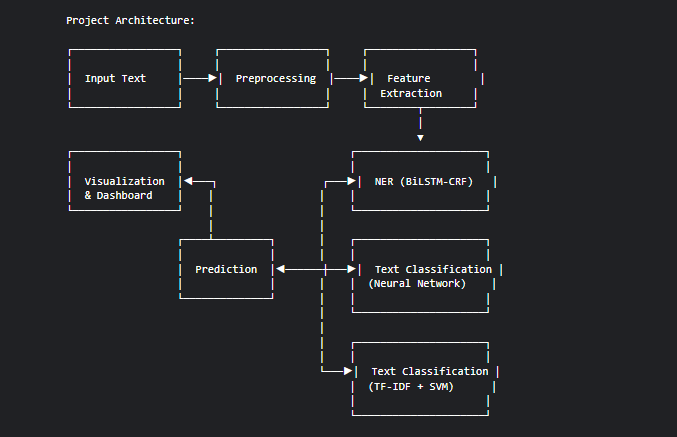

# 🧠 NLP Pipeline: Named Entity Recognition & Text Classification

An end-to-end Natural Language Processing pipeline implementing Named Entity Recognition (NER) and Text Classification using both classical machine learning and deep learning approaches. This project demonstrates advanced NLP techniques with a focus on production-ready implementation.

---

## 🚀 Features

- **Named Entity Recognition**: Custom BiLSTM-CRF implementation in PyTorch
- **Text Classification**: Classical (TF-IDF + SVM) and deep learning models
- **Interactive Dashboard**: Streamlit app for real-time text analysis
- **Comprehensive Evaluation**: Detailed metrics and error analysis
- **Production-Ready**: Optimized data loading and model inference

---

## 📚 Table of Contents

1. [Project Overview](#project-overview)
2. [Model Architectures](#model-architectures)
3. [Installation](#installation)
4. [Usage](#usage)
5. [Example Input/Output](#example-inputoutput)
6. [Project Structure](#project-structure)
7. [Performance](#performance)
8. [Future Improvements](#future-improvements)
9. [License](#license)

---

## 🔍 Project Overview

This project implements a complete NLP pipeline for two fundamental tasks:

- **Named Entity Recognition (NER)**: Identify and classify named entities in text.
- **Text Classification**: Categorize documents into predefined classes.

Both traditional and modern techniques are demonstrated:

- TF-IDF + SVM for classical ML
- Custom deep learning models in PyTorch
- End-to-end preprocessing, training, and evaluation workflows

## Project Architecture

Here's a visual overview of the architecture used in this project:



---

## 🧠 Model Architectures

### BiLSTM-CRF for NER

- **Word Embeddings** → Dense vector representations
- **BiLSTM** → Capture context from both directions
- **CRF Layer** → Model tag dependencies for valid sequences

### Text Classification Models

- **TF-IDF + SVM**:
  - Fast, interpretable, suitable for small/medium datasets
- **Neural Network**:
  - Embedding layer → Global pooling → MLP classifier
  - Captures semantic relationships in text

---

## 💻 Installation

### Prerequisites
- Python 3.8+
- Git

### Quick Setup
```bash
# Clone the repository
git clone https://github.com/yourusername/ner-text-classification-pipeline.git
cd ner-text-classification-pipeline

# Create virtual environment
python -m venv venv
source venv/bin/activate  # Windows: venv\Scripts\activate

# Install dependencies
pip install -r requirements.txt

# Download spaCy model
python -m spacy download en_core_web_sm

# Prepare data
python streamlit_app/prepare_data.py
```

---

## 📊 Usage

### Launch Streamlit App
```bash
cd streamlit_app
streamlit run app.py
```
Visit [http://localhost:8501](http://localhost:8501) to interact with the models.

### Train Models from Scratch
```bash
jupyter notebook
```
Then run notebooks in this order:
1. `data-exploration.ipynb`
2. `preprocessing.ipynb`
3. `classical-ml.ipynb`
4. `bilstm-crf.ipynb`
5. `evaluation.ipynb`

### Use Models in Python
```python
import torch
import pickle
from src.models.bilstm_crf import BiLSTM_CRF
from src.models.text_classifier import TextClassifier

# Load vocabulary
data = pickle.load(open('data/vocab_data.pkl', 'rb'))

# Load NER model
ner_model = BiLSTM_CRF(
    vocab_size=len(data['ner_word2idx']),
    tag_to_ix=data['ner_tag2idx'],
    embedding_dim=100,
    hidden_dim=256
)
ner_model.load_state_dict(torch.load('models/bilstm_crf_ner.pt', map_location='cpu'))
ner_model.eval()

# Load text classification model
text_model = TextClassifier(
    vocab_size=len(data['text_word2idx']),
    embedding_dim=100,
    hidden_dim=128,
    num_classes=data['num_classes']
)
text_model.load_state_dict(torch.load('models/text_classifier.pt', map_location='cpu'))
text_model.eval()
```

---

## ✨ Example Input/Output

### Named Entity Recognition
**Input:**
```
Apple Inc. is planning to open a new office in Berlin next year.
```
**Output:**
```
[ORG] Apple Inc. is planning to open a new office in [LOC] Berlin next year.
```

### Text Classification
**Input:**
```
The European Commission has fined Google €1.49 billion for breaching EU antitrust rules.
```
**Output:**
```
Class: Business (Confidence: 0.92)
```

---

## 📁 Project Structure
```
ner-text-classification-pipeline/
├── data/
├── models/
├── notebooks/
├── src/
│   ├── models/
│   ├── preprocessing/
│   └── utils/
├── streamlit_app/
├── requirements.txt
└── README.md
```

---

## 📈 Performance

### NER Results
| Entity | Precision | Recall | F1-Score |
|--------|-----------|--------|----------|
| PER    | 0.96      | 0.95   | 0.96     |
| ORG    | 0.89      | 0.86   | 0.87     |
| LOC    | 0.92      | 0.93   | 0.93     |
| MISC   | 0.81      | 0.79   | 0.80     |
| **Overall** | **0.90** | **0.88** | **0.89** |

### Text Classification Results
| Model       | Accuracy | Precision | Recall | F1 | Training Time |
|-------------|----------|-----------|--------|----|----------------|
| TF-IDF+SVM  | 0.92     | 0.92      | 0.92   | 0.92 | 3 min         |
| Neural Net  | 0.91     | 0.91      | 0.91   | 0.91 | 15 min        |

---

## 🔮 Future Improvements

- Integrate pre-trained embeddings (GloVe, Word2Vec)
- Compare with transformer models (BERT, RoBERTa)
- Automate hyperparameter tuning
- Apply model distillation for faster inference
- Extend multilingual capabilities

---

## 📄 License

This project is licensed under the MIT License – see the [LICENSE](LICENSE) file for details.

> If you find this project useful, please consider giving it a ⭐

